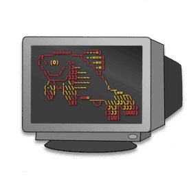

| [](https://fishshell.com) | [](https://neovim.io) |
|:---:|:---:|
|https://fishshell.com | https://neovim.io | 

# My Dotfiles

This repo contains my fish and neovim set up.  

These are my personal dotfiles and they are heavily gearded towards javascript development, in saying that with minor tweaking they could be adapted for most modern languages.

### Prerequisites

You must be running Ubuntu.

### Bootstrap Install

```bash
git clone https://github.com/CrashyBang/dotfiles.git  ~/.dotfiles && cd ~/.dotfiles && ./bootstrap.sh

```

### Scripts

* `theme` takes one name argument (base16) i.e `solarized` and another option background argument i.e `dark` (requires `base16-builder`).
* `repoch` recusively scans all git directories below the current and lets you know if you have uncommited changes.
* `repocl` recusively scans all git directories below the current and deletes all untracked files.
* `xi` small wrapper around `nvim` and `nvr` that figures out what command should be used based on `$TERM`.

### Controls

I have put these here more as a point of reference they may not always be 100% up-to-date but I will do my best:

**TMUX:**

**Fish**

**Keybindings:**

* `Ctrl` + `e`: Will drop your current command into your `$EDITOR`
* `Ctrl` + `f`: Will offer suggestions if the last command failed

**Utilites:**

* `transfer` + _filename_ where _filename_ is a valid file path will upload any file to [transfer.sh](https://transfer.sh/) 

**Neovim**

**Commands:**

_This list is not exhausitve it is simply the commands I have not provided keybings for_

* `:Search` + _term_: Will search the entrire project for the sepecified _term_.
* `:Codi`: Open an interactive scratch pad for the cuurent file.
* `:Remove`: Delete a buffer and the file on disk simultaneously.
* `:Unlink`: Like `:Remove`, but keeps the now empty buffer.
* `:Move`: Rename a buffer and the file on disk simultaneously.
* `:Rename`: Like `:Move`, but relative to the current file's containing directory.
* `:Chmod`: Change the permissions of the current file.
* `:Mkdir`: Create a directory, defaulting to the parent of the current file.
* `:Find`: Run `find` and load the results into the quickfix list.
* `:Locate`: Run `locate` and load the results into the quickfix list.
* `:Wall`: Write every open window.
* `:SudoWrite`: Write a privileged file with `sudo`.
* `:SudoEdit`: Edit a privileged file with `sudo`.

**Keybindigs:**

_I have used the term_ `<leader>` _to denote my leader key (which is currently just the default `\`)_ 

* `<leader>` + `o`: Will open undo history 
* `<leader>` + `l`: Will format the code in the current split
* `<leader>` + `t`: Will open a file tree in the current split
* `<leader>` + `f`: Will open a fuzzy finder for your files powered by [fzf](https://github.com/junegunn/fzf)
* `<leader>` + `b`: Will open a fuzzy finder for your buffers powered by [fzf](https://github.com/junegunn/fzf)
* `<leader>` + `r`: Will force a reload from disk
* `<leader>` + `,` + `o`: Will open the location window
* `<leader>` + `,` + `c`: Will close the location window
* `<leader>` + `,` + `e`: Go to current error/warning
* `<leader>` + `,` + `n`: Go to next error/warning
* `<leader>` + `,` + `p`: Go to previous error/warning
* `→`: Will switch to the next left split
* `←`: Will switch to the next right split
* `↑`: Will switch to the next above split
* `↓`: Will switch to the next below split
* `Ctrl` + `→`: Will resize the current split 5 columns left
* `Ctrl` + `←`: Will resize the current split 5 columns right
* `Ctrl` + `↑`: Will resize the current split 5 rows up
* `Ctrl` + `↓`: Will resize the current split 5 rows down
* `Ctrl` + `s`: Will expand the current snippet
* `Ctrl` + `e`: Will expand the current [emmet](http://emmet.io/) abbreviation
* `cs` + _old_ + _new_: Will replace the out _old_ symbol with the specified _new_ symbol using [vim-surround](https://github.com/tpope/vim-surround)

### Screens

### What We're Cooking With

**Javascript**

- [Node.js](https://nodejs.org/en/)
- [diff-so-fancy](https://github.com/so-fancy/diff-so-fancy)
- [base16-builder](https://github.com/base16-builder/base16-builder)
- [tern](http://ternjs.net/)

**Shell**

- [Fish](https://fishshell.com/)
- [Fisherman](http://fisherman.sh/)
- [eclm](https://github.com/oh-my-fish/theme-eclm)
- [git-flow](https://github.com/petervanderdoes/gitflow-avh)
- [thefuck](https://github.com/nvbn/thefuck)
- [upto](https://github.com/fisherman/upto)
- [z](https://github.com/fisherman/z)
- [fzf](https://github.com/junegunn/fzf)
- [ripgrep](https://github.com/BurntSushi/ripgrep)

**Editor**

- [Neovim](https://neovim.io/)
- [python-client](https://github.com/neovim/python-client)
- [neovim-remote](https://github.com/mhinz/neovim-remote)
- [vim-plug](https://github.com/junegunn/vim-plug)
- [fzf.vim](https://github.com/junegunn/fzf.vim)
- [emmet-vim](http://mattn.github.io/emmet-vim/)
- [neosnippet](https://github.com/Shougo/neosnippet.vim)
- [deoplete](https://github.com/Shougo/deoplete.nvim)
- [deoplete-ternjs](https://github.com/carlitux/deoplete-ternjs)
- [ale](https://github.com/w0rp/ale)
- [delimitNate](https://github.com/Raimondi/delimitMate)
- [vim-surround](https://github.com/tpope/vim-surround)
- [vim-commentary](https://github.com/tpope/vim-commentary)
- [vim-peekaboo](https://github.com/junegunn/vim-peekaboo)
- [undotree](https://github.com/mbbill/undotree)
- [vim-indent-guides](https://github.com/nathanaelkane/vim-indent-guides)
- [terminus](https://github.com/brettanomyces/nvim-terminus)
- [vim-dirvish](https://github.com/justinmk/vim-dirvish)
- [vim-cool](https://github.com/romainl/vim-cool)
- [vim-polygot](https://github.com/sheerun/vim-polyglot)
- [vim-flow](https://github.com/flowtype/vim-flow)
- [neoformat](https://github.com/sbdchd/neoformat)
- [vim-lion](https://github.com/tommcdo/vim-lion)
- [vim-airline](https://github.com/vim-airline/vim-airline)
- [vim-airline-themes](https://github.com/vim-airline/vim-airline-themes)
- [codi.vim](https://github.com/metakirby5/codi.vim)
- [vim-eunuch](https://github.com/tpope/vim-eunuch)
